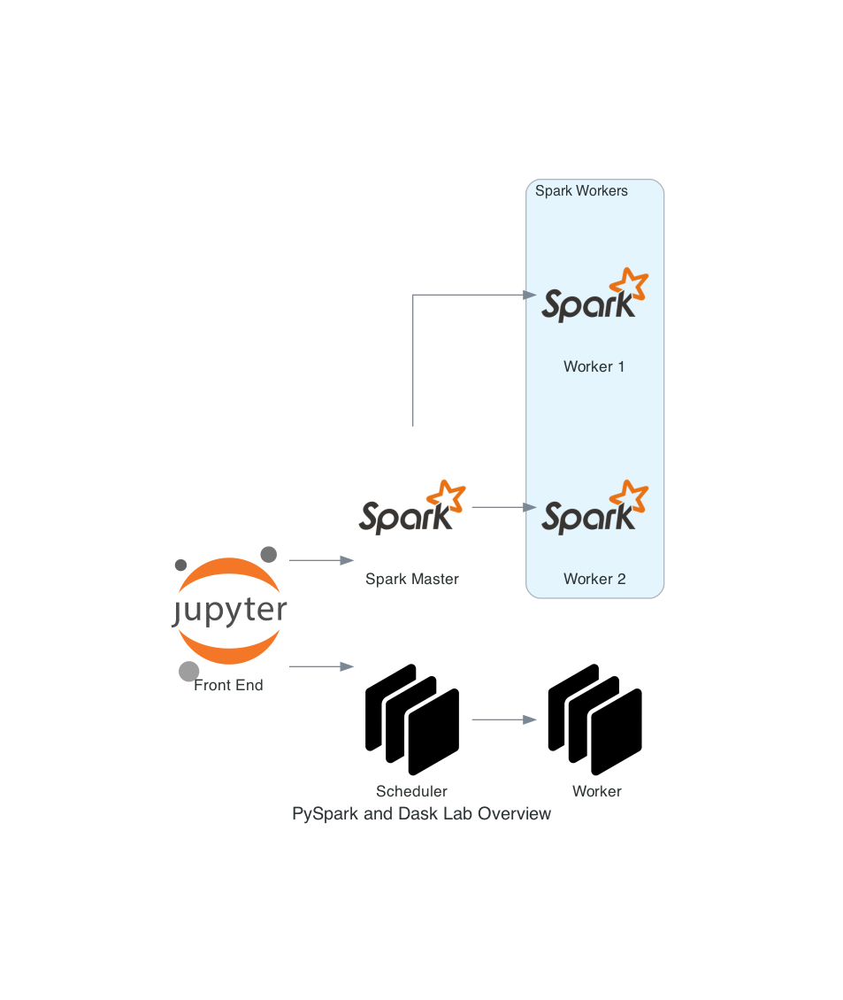

# PySpark and Dask Lab :test_tube:
## What is this?
This repository provides a simple means of bringing up a small Spark cluster (1 x Spark Master, 1 x Spark Worker), a small Dask Cluster (1 x Dask Scheduler, 1 x Dask Worker), a minio object storage API (an S3 compliant storage solution) and a Jupyter Lab instance (with `Python3.7` & `Python3.8` environments). The primary driver behind the creation of this lab is to provide a means of learning development approaches using things like Apache Spark, Dask and an S3-esque object stores but not just doing it locally. 



## Getting Started
### Pre-requisites 

- `docker` - For building the containers
- `docker-compose` - For standing up the containers

### Diving Straight In
```
git clone <bitbucket-repo>
cd data-science-docker-lab
docker-compose up
```
This may take some time to complete as the docker containers are pulled, rebuilt and then stood up. Once it does complete, you should be able to access the all the services on the ports below.

| Service         | URL             | Credentials Required | Credential Defaults |
| -----------     | -----------     | -----------          | -----------         |
| Jupyter Lab     | `localhost:8888`| Yes                  | Token: `1234567890`
| Minio           | `localhost:9000`| Yes                  | Access Key: `ACCESSKEY` Secret Key: `VERYSECRETACCESSKEY` |
| Spark Master    | `localhost:8080`| No                   | N/A |
| Spark Worker    | `localhost:8081`| No                   | N/A |
| Dask Scheduler - UI  |`localhost:8786`| No | N/A  |

All of the credential defaults can be amended within the `docker-compose.yaml` if required.
## Example Notebooks

The jupyterlab instance has several notebooks included to support easy spin up and save google time.

1) `MinioPushAndPull` - This notebook goes through an end to end example of using the Minio API to push an example file and then retrieve it again.
2) `PySparkConnectionTest` - This notebook provides a method to check the connection between the JupyterLab instance and the Spark Master through creating a `SparkContext`
3) `PySparkDataConnection` - This notebook goes through an example of using Spark to collect a file from Minio.
4) `DaskDistrbutedExecutionExample` - This notebook shows how to create a Dask Client, connect it to a Dask scheduler and then execute series of python functions and return the results.

## License
MIT
## FAQ
### 1) Getting Data In

Using the GUI:

1. Open a browser and navigate Minio at `localhost:9000`
2. Enter the Minio Access Key and Secret Access Key. These are set to the following defaults. Access Key: `ACCESSKEY` Secret Access Key: `VERYSECRETACCESSKEY`. If you would like to change these, you can do so by changing the defaults within `docker-compose.yml`
3. Click on the `+` icon in the bottom right of the screen, click `Create Bucket`, input a name and then press enter. This should automatically open the bucket for you.
4. Navigate back to the `+` icon in the bottom right, click `Upload File` and then use the file navigator to select a file.

Mission accomplished. 

Using the API:

An example of how to upload data to Minio via the API has been provided within the Jupyter Lab Container. This notebook can be found at `notebooks/examples/MinioPushAndPull`

### 2) How do I fix errors relating to Spark Contexts

This is something that has come up several times during use. Due to how PySpark works with a Jupyter Notebook, once you set up an interactive SparkContext, you can't set another one up. This means that if you create a new notebook and attempt to create a Spark Context, whilst having a previous Juypyter Notebook (and Kernel) open, it will fail. An easy fix for this is to just save the other notebook, kill the kernel and then close the notebook

### 3) PySpark not producing output/executing commands

This is again something that has come up several times during use. This is usually related to the FAQ 2 and can be solved by navigating to the Spark Master on `localhost:8080` and looking to see if there are any `RUNNING` spark jobs which aren't what you are trying to execute. If there is, you can use the Spark Master GUI to kill the job and your job should then execute. An alternative to this is to amend `docker-compose.yaml` to have more than one Spark Worker node.

